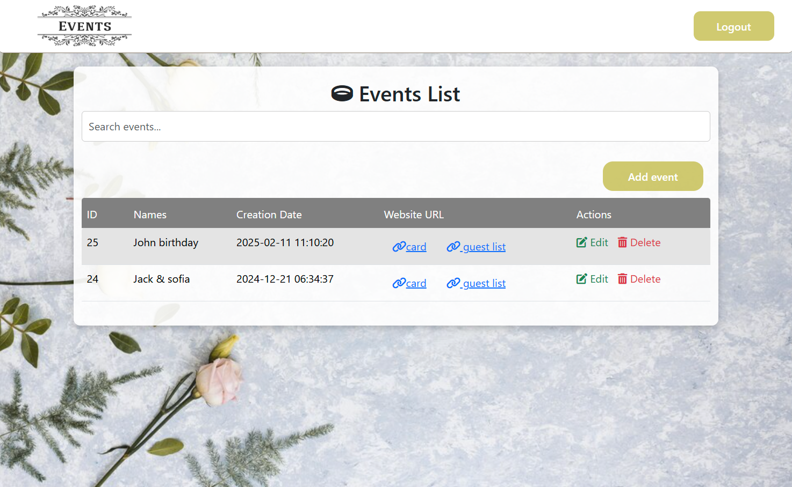
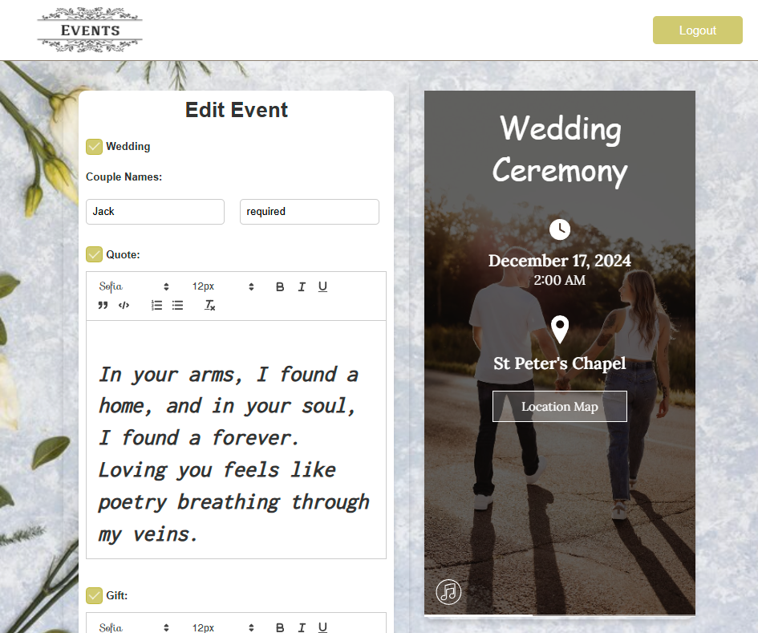
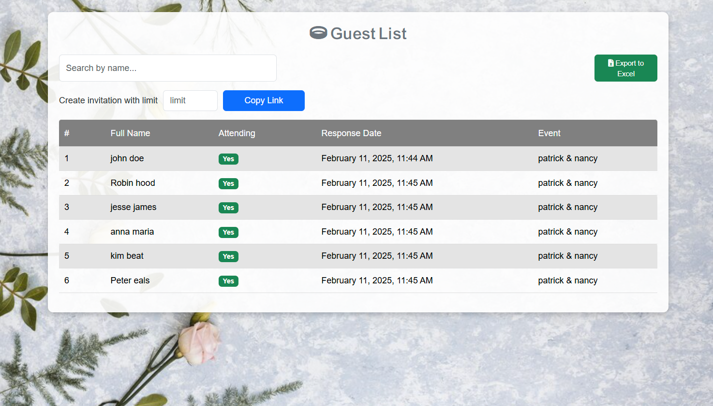
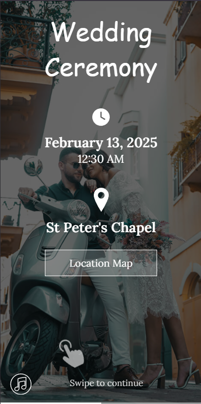

# 🎉 Event Management Web Application

## 📌 Description

The Event Management Web Application simplifies event organization by enabling admins to create events and generate personalized invitations. It supports three main user roles:

- **Admin**: Creates events and manages access for customers
- **Customer**: Generates and shares invitation links with optional RSVP limits
- **Attendee**: Uses the provided links to RSVP

This system provides a seamless and efficient way to manage events and track attendance.

## 📖 Table of Contents

- [Features](#features)
- [Technologies Used](#technologies-used)
- [User Roles](#user-roles)
- [Screenshots & GIFs](#screenshots--gifs)
- [License](#license)

## ✨ Features

- ✅ Event Creation – Admins can create and manage events
- ✅ Invitation Management – Customers can generate and distribute invitation links
- ✅ RSVP System – Attendees can confirm their attendance via unique links
- ✅ Response Limits – Customers can control the number of RSVPs per invitation

## 🛠 Technologies Used

- Backend: PHP (Vanilla)
- Frontend: JavaScript, HTML, CSS
- Database: MySQL

## 👥 User Roles

### 🔹 Admin
- Creates events
- Grants customers access to event management

### 🔹 Customer
- Generates invitation links
- Distributes invitations and tracks RSVPs

### 🔹 Attendee
- Uses invitation links to RSVP

## 🖼 Screenshots & GIFs

### 🎭 Event Creation (Admin Panel)

### ✉️ Invitation Management (Customer View)

### 📩 RSVP Process (Attendee Experience)

### 🎥 Live Demo GIF – How it Works

## 📜 License

This project is licensed under the [Creative Commons Attribution-NonCommercial 4.0 International License](https://creativecommons.org/licenses/by-nc/4.0/).

### You may:
- Share and adapt the software for personal and non-commercial purposes only

### You may not:
- Use this software for commercial purposes
- Distribute or modify the project for profit

For full legal details, visit: [Creative Commons License](https://creativecommons.org/licenses/by-nc/4.0/)